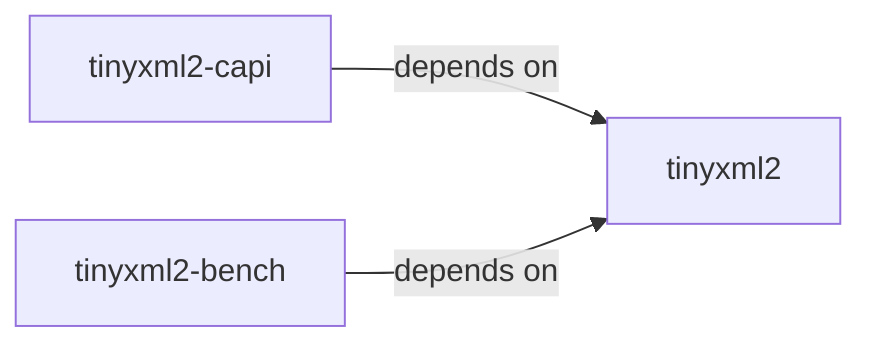
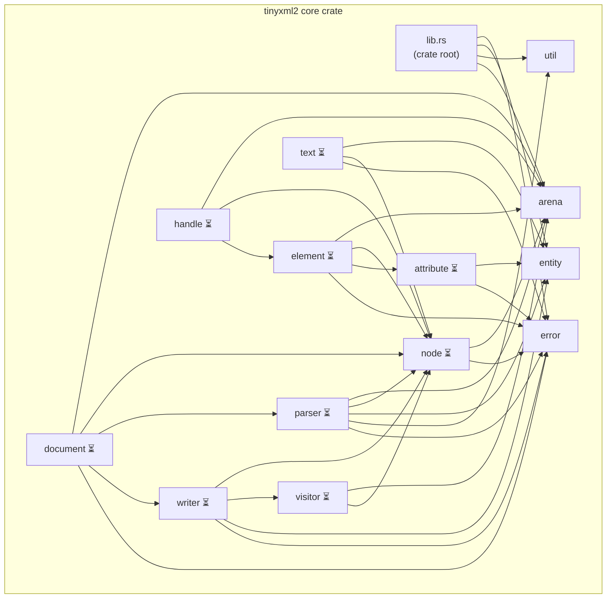

# Architecture

## Overview

**tinyxml2-rs** is a ground-up Rust implementation of the [TinyXML2](https://github.com/leethomason/tinyxml2) C++ API. It is **not** a wrapper around the C++ library, **not** a line-by-line translation of C++ code, and **not** a fork. It is an entirely new implementation that treats TinyXML2 as a behavioral specification — matching its parsing semantics, serialization output, entity handling, and error behavior — while using Rust's type system, ownership model, and standard library conventions internally.

The DOM is backed by a **generational arena allocator** where the `Document` owns all nodes, mirroring TinyXML2's model where `XMLDocument` owns everything. The parser is a **recursive-descent, single-pass** design that builds the DOM tree directly into the arena. The project targets **Rust edition 2024** with an **MSRV of 1.85.0** and enforces `#![forbid(unsafe_code)]` in the core crate.

---

## Crate Structure

The workspace contains three crates under `crates/`:

```
┌─────────────────────────────────────────────────────────┐
│                   Cargo Workspace                       │
│                                                         │
│  ┌─────────────────┐                                    │
│  │    tinyxml2      │◄──────────────────────────────┐   │
│  │  (core library)  │                               │   │
│  │                  │◄──────────────┐               │   │
│  │  DOM, Parser,    │               │               │   │
│  │  Writer, Arena   │               │               │   │
│  └─────────────────┘               │               │   │
│           ▲                        │               │   │
│           │ depends on             │ depends on    │   │
│           │                        │               │   │
│  ┌────────┴────────┐      ┌───────┴───────────┐   │   │
│  │  tinyxml2-capi  │      │  tinyxml2-bench   │   │   │
│  │   (C FFI layer) │      │   (benchmarks)    │   │   │
│  │                 │      │                   │   │   │
│  │  extern "C" fns │      │  criterion suite  │   │   │
│  │  static/shared  │      │  parse, serialize │   │   │
│  │  lib output     │      │  traverse, memory │   │   │
│  └─────────────────┘      └───────────────────┘   │   │
│                                                         │
└─────────────────────────────────────────────────────────┘
```

| Crate | Type | Purpose |
|-------|------|---------|
| `tinyxml2` | `lib` | Core library. DOM, parser, writer, arena, error types. `#![forbid(unsafe_code)]`. |
| `tinyxml2-capi` | `cdylib` + `staticlib` | C FFI compatibility layer. Exposes `extern "C"` functions matching TinyXML2's C API. Uses `unsafe` only at the FFI boundary. |
| `tinyxml2-bench` | `lib` (bench harness) | Criterion benchmark suite for parse speed, serialization throughput, DOM traversal, and memory usage. |

**Dependency flow:**



Both `tinyxml2-capi` and `tinyxml2-bench` depend on the core `tinyxml2` crate. There is no dependency between `tinyxml2-capi` and `tinyxml2-bench`.

---

## Module Structure

The `tinyxml2` core crate is organized into the following modules. Modules marked with *(planned)* exist in the design but have not yet been implemented.

| Module | File | Responsibility |
|--------|------|----------------|
| `lib` | `lib.rs` | Crate root. Public API surface, re-exports, `Whitespace` enum, `ParseOptions` builder. |
| `error` | `error.rs` | `XmlError` enum, `ParseErrorKind`, `Result<T>` alias. Every TinyXML2 error code has a corresponding variant. Parse errors carry line numbers. Implements `std::error::Error`, `Display`, `Clone`, `PartialEq`. |
| `entity` | `entity.rs` | XML entity encoding and decoding. The 5 predefined named entities (`&amp;`, `&lt;`, `&gt;`, `&quot;`, `&apos;`), decimal numeric references (`&#N;`), and hexadecimal numeric references (`&#xN;`). Provides `Cow`-returning variants to avoid allocation when no entities are present. Also implements `decode_numeric_only`. |
| `arena` | `arena.rs` | Generational arena allocator. `Arena<T>`, `NodeId`, `Slot<T>` (occupied/vacant enum), free list, generation counters, iterators. Foundation of the entire DOM memory model. |
| `node` | `node.rs` | `NodeData` struct, `NodeKind` enum, `Attribute`, `ElementData`, and `TextData` structs. Stores parent/child/sibling `NodeId` links. |
| `document` | `document.rs` | `Document` struct. Owns the `Arena<NodeData>`, holds the root node ID, parse options, has_bom, and error state. |
| `typed` | `typed.rs` | Typed attribute and text parsing implementations on `Document` (e.g., `query_int_attribute`, `int_text`). |
| `parser` | `parser.rs` | Recursive-descent XML parser. Consumes valid UTF-8 strings and builds `NodeData` entries directly into the arena. Line tracking, entity resolution, depth limiting. |
| `writer` | *(planned)* | Dual-mode serializer. Visitor-based DOM printer and standalone streaming writer. Pretty-print and compact modes with configurable indentation. |
| `visitor` | *(planned)* | `XmlVisitor` trait. Depth-first traversal with `visit_enter`/`visit_exit` callbacks for each node type, matching TinyXML2's `XMLVisitor`. |
| `handle` | *(planned)* | `XmlHandle` convenience wrapper. Chainable navigation (`first_child_element()`, `next_sibling_element()`) that returns another handle instead of `Option`, matching TinyXML2's `XMLHandle`. |
| `util` | `util.rs` | Character classification (`is_whitespace`, `is_name_start_char`, `is_name_char`), string helpers (`skip_whitespace`, `collapse_whitespace`, `read_name`), BOM handling. Used by the parser and entity modules. |

---

## DOM Memory Model

### The Problem

XML DOMs form a tree of nodes where children reference parents and siblings reference each other. In C++, TinyXML2 solves this with raw pointers: `XMLDocument` owns all nodes via `new`/`delete`, and nodes store `XMLNode*` pointers to parent, first child, last child, previous sibling, and next sibling. This is fast but inherently unsafe.

In Rust, we need a memory model that:

1. Allows nodes to reference each other (mutual/cyclic references)
2. Lets the `Document` own all node memory
3. Provides O(1) access, insertion, and deletion
4. Is memory-safe without `unsafe` code
5. Detects use-after-free (stale references to deleted nodes)

### Why Not `Rc<RefCell<T>>`?

The obvious Rust approach — `Rc<RefCell<Node>>` with `Weak` back-references — has significant drawbacks:

- **Reference counting overhead**: Every clone/drop touches an atomic counter
- **Runtime borrow checking**: `RefCell` panics on aliased mutable borrows, turning compile-time safety into runtime crashes
- **Cycle leaks**: Parent→child and child→parent create reference cycles. `Weak` solves this but adds complexity and more atomic operations
- **Memory fragmentation**: Each node is a separate heap allocation, destroying cache locality
- **Doesn't match TinyXML2's model**: TinyXML2's `XMLDocument` owns everything centrally. `Rc` distributes ownership, making it hard to implement `Document::Clear()` or bulk operations

### Why Not Raw Pointers?

Using `unsafe` raw pointers would match TinyXML2's performance profile but:

- Defeats Rust's safety guarantees — the entire point of rewriting in Rust
- Requires careful manual lifetime management
- Makes use-after-free a silent, undefined-behavior bug instead of a detectable error
- The core crate enforces `#![forbid(unsafe_code)]`

### The Solution: Generational Arena

The `Arena<T>` in [`arena.rs`](crates/tinyxml2/src/arena.rs) is a generational arena allocator:

```
Arena<NodeData>
┌────────┬──────────────────────┬────────────┐
│ Index  │ Slot                 │ Generation │
├────────┼──────────────────────┼────────────┤
│   0    │ Occupied(Element)    │     0      │
│   1    │ Vacant(next_free=3)  │     2      │  ← was deallocated twice
│   2    │ Occupied(Text)       │     0      │
│   3    │ Vacant(next_free=MAX)│     1      │  ← was deallocated once
│   4    │ Occupied(Comment)    │     0      │
└────────┴──────────────────────┴────────────┘

NodeId { index: 0, generation: 0 }  →  valid, returns &Element
NodeId { index: 1, generation: 1 }  →  stale! generation is now 2, returns None
```

**Key data structures:**

- **`Arena<T>`** — A `Vec<Slot<T>>` where each slot is either `Occupied(T)` or `Vacant(next_free_index)`, plus a parallel `Vec<u32>` of generation counters and a free list head
- **`NodeId`** — A `Copy` struct containing a `u32` index and a `u32` generation. 8 bytes total, cheaper to copy than any pointer-based scheme
- **`Slot<T>`** — An enum: `Occupied(T)` holds a live value, `Vacant(u32)` stores the next free slot index forming a singly-linked free list

**How deletion works:**

1. The slot at `id.index` is swapped from `Occupied(value)` to `Vacant(old_free_head)`
2. The free list head is updated to point to this slot
3. The generation counter for this slot is incremented (wrapping): `generations[index] += 1`
4. Any `NodeId` still holding the old generation will fail the generation check on access, returning `None` instead of accessing freed data

**Complexity guarantees:**

| Operation | Time | Notes |
|-----------|------|-------|
| `alloc()` | O(1) amortized | Pop from free list, or push to vec |
| `dealloc()` | O(1) | Push to free list + generation bump |
| `get()` / `get_mut()` | O(1) | Index into vec + generation check |
| `contains()` | O(1) | Delegates to `get()` |
| `clear()` | O(n) | Resets all state |

**Why this works well for a DOM:**

- All nodes live in a single contiguous `Vec` — cache-friendly iteration
- The `Document` owns the `Arena`, matching TinyXML2's ownership model exactly
- `NodeId` is `Copy + Clone + Eq + Hash` — can be stored freely in node structs, hash maps, etc.
- No `unsafe` code — stale IDs are detected, not undefined behavior
- O(1) everything — competitive with raw pointer performance

---

## Parser Design

The parser (planned, module `parser`) is a **recursive-descent parser** that processes XML input in a **single pass**, building DOM nodes directly into the arena as it goes.

### Architecture

```
Input &str
    │
    ▼
┌──────────────┐     ┌──────────────┐     ┌──────────────┐
│  Strip BOM   │────▶│  Parse Prolog│────▶│  Parse Body  │
│  (util)      │     │  (<?xml?>)   │     │  (recursive) │
└──────────────┘     └──────────────┘     └──────────────┘
                                                │
                     Recursive descent:         │
                     ┌──────────────────────────┘
                     ▼
              ┌─────────────┐
              │ parse_node() │◄──────────────────────┐
              └──────┬──────┘                        │
                     │ dispatches based on '<' ...    │
        ┌────────────┼────────────┬──────────┐       │
        ▼            ▼            ▼          ▼       │
   parse_element  parse_comment  parse_cdata  parse_unknown
        │            │            │          │       │
        │ children   └────────────┴──────────┘       │
        │    └───────────────────────────────────────┘
        ▼
   parse_attributes ──▶ parse_text (between tags)
```

### Key Design Decisions

1. **Single-pass into arena**: The parser does not build an intermediate AST or token stream. As each XML construct is recognized, a `NodeData` is allocated directly in the `Arena`. This minimizes memory overhead and avoids a second traversal pass.

2. **Line tracking**: The parser maintains a running line counter by counting `\n` characters as it advances through the input. Every parse error includes the 1-based line number where the error was detected. The `skip_whitespace()` utility function in [`util.rs`](crates/tinyxml2/src/util.rs) returns both the remaining input and the number of newlines consumed, keeping line tracking integrated into whitespace handling.

3. **Entity resolution**: Entity decoding (`&amp;` → `&`, `&#65;` → `A`, etc.) is handled by the [`entity`](crates/tinyxml2/src/entity.rs) module during text and attribute value parsing. The `decode_cow()` function avoids allocation when no entities are present (the common case). Entity processing can be disabled via `ParseOptions::process_entities`.

4. **Depth limiting**: `ParseOptions::max_depth` (default 500, matching TinyXML2's `TINYXML2_MAX_ELEMENT_DEPTH`) caps the maximum element nesting depth. Each recursive call to `parse_element` increments a depth counter; exceeding the limit produces `XmlError::ElementDepthExceeded`. This prevents stack overflow on deeply nested or malicious input.

5. **Whitespace handling**: Three modes controlled by `ParseOptions::whitespace`:
   - `Preserve` (default): Keep all whitespace exactly as-is
   - `Collapse`: Strip leading/trailing, collapse internal runs to single spaces, convert all whitespace chars to spaces (implemented in `util::collapse_whitespace()`)
   - `Pedantic`: Like `Preserve` but also retains whitespace-only text nodes

6. **BOM handling**: The parser strips the UTF-8 BOM (`EF BB BF`) if present at the start of input, via `util::strip_bom()`.

---

## Writer Design

The writer (planned, module `writer`) provides **dual-mode** XML serialization:

### Mode 1: Visitor-Based DOM Serializer

The primary serialization path uses the `XmlVisitor` trait to walk the DOM tree depth-first:

```
Document::save_to_string()
    │
    ▼
XmlPrinter (implements XmlVisitor)
    │
    ├── visit_enter(Document)
    │   ├── visit_enter(Element "root")
    │   │   ├── visit(Text "hello")
    │   │   ├── visit_enter(Element "child")
    │   │   │   └── visit(Text "world")
    │   │   └── visit_exit(Element "child")
    │   └── visit_exit(Element "root")
    └── visit_exit(Document)
    │
    ▼
Output: <?xml version="1.0"?>\n<root>hello<child>world</child></root>
```

The `XmlPrinter` accumulates output into a `String` (or writes to an `impl Write`), handling indentation, newlines, and entity encoding as it visits each node. This matches TinyXML2's `XMLPrinter` which is both a visitor and a standalone writer.

### Mode 2: Standalone Streaming API

For use cases where building a DOM is unnecessary (e.g., generating XML programmatically), the writer also provides a streaming API:

```rust
let mut writer = XmlWriter::new(buffer);
writer.open_element("root")?;
writer.push_attribute("version", "1.0")?;
writer.push_text("hello")?;
writer.close_element()?;
```

This writes directly to the output without constructing any DOM nodes, matching TinyXML2's `XMLPrinter` used in standalone mode.

### Output Modes

| Mode | Description |
|------|-------------|
| Pretty-print (default) | Newlines after each element, configurable indentation (default: 4 spaces per level) |
| Compact | No added whitespace — minimal output size |

Both modes correctly handle entity encoding for text content and attribute values using `entity::encode_text()` and `entity::encode_attribute()`.

---

## Error Handling

### Rust API: `Result<T, XmlError>`

The Rust API uses Rust's standard `Result` pattern. Every fallible operation returns `Result<T, XmlError>` (aliased as `tinyxml2::Result<T>`). This provides:

- **Compile-time enforcement**: Callers must handle errors or explicitly ignore them
- **Propagation with `?`**: Errors bubble up naturally through the call stack
- **Pattern matching**: Each error variant carries structured data (line numbers, expected/found names)

### TinyXML2 Comparison: Error Polling

TinyXML2 uses a fundamentally different model:

```cpp
// TinyXML2 (C++)
doc.Parse(xml);
if (doc.Error()) {
    printf("Error: %s at line %d\n", doc.ErrorStr(), doc.ErrorLineNum());
}
```

Errors are stored on the `XMLDocument` and polled after the fact. Operations silently fail, and the caller must remember to check. This is error-prone (easy to forget the check) and doesn't compose well (errors from nested operations can be lost).

### Error Variants

The [`XmlError`](crates/tinyxml2/src/error.rs) enum covers every error code from TinyXML2, plus `InvalidNodeId` which is unique to the arena-based model:

| Variant | TinyXML2 Equivalent | Data |
|---------|---------------------|------|
| `NoAttribute` | `XML_NO_ATTRIBUTE` | — |
| `WrongAttributeType` | `XML_WRONG_ATTRIBUTE_TYPE` | — |
| `Io(std::io::Error)` | `XML_ERROR_FILE_*` | Wrapped I/O error |
| `Parse { kind, line, message }` | `XML_ERROR_PARSING_*` | Kind enum + line + optional detail |
| `EmptyDocument` | `XML_ERROR_EMPTY_DOCUMENT` | — |
| `MismatchedElement { line, expected, found }` | `XML_ERROR_MISMATCHED_ELEMENT` | Line + tag names |
| `CanNotConvertText` | `XML_CAN_NOT_CONVERT_TEXT` | — |
| `NoTextNode` | `XML_NO_TEXT_NODE` | — |
| `ElementDepthExceeded { line, max_depth }` | `XML_ELEMENT_DEPTH_EXCEEDED` | Line + limit |
| `InvalidNodeId` | *(no equivalent)* | — |

Every error implements `std::error::Error`, `Display`, `Clone`, `PartialEq`, `Eq`, `Send`, and `Sync`.

---

## Design Philosophy

The project follows a strict priority hierarchy for decision-making:

```
    ┌─────────────────┐
    │  1. Correctness  │  Match TinyXML2's behavior exactly
    ├─────────────────┤
    │ 2. Compatibility │  API shape mirrors TinyXML2 where possible
    ├─────────────────┤
    │    3. Safety     │  #![forbid(unsafe_code)] in core, no UB
    ├─────────────────┤
    │ 4. Maintainability│  Clear module boundaries, tested, documented
    ├─────────────────┤
    │  5. Performance  │  O(1) arena ops, zero-copy where feasible
    └─────────────────┘
```

### 1. Correctness > Everything

TinyXML2 is treated as the **specification**. If TinyXML2 and the XML spec disagree, we match TinyXML2's behavior (and document the divergence). This includes edge cases in entity handling, whitespace processing, and error reporting.

### 2. Compatibility > Safety

The public API mirrors TinyXML2's API shape as closely as idiomatic Rust allows. A C++ developer familiar with TinyXML2 should recognize the Rust API immediately. Method names, option names, and behavioral semantics align. The `tinyxml2-capi` crate takes this further by providing actual C-callable functions.

### 3. Safety > Maintainability

The core `tinyxml2` crate enforces `#![forbid(unsafe_code)]`. The generational arena provides use-after-free detection without `unsafe`. The `tinyxml2-capi` crate uses `unsafe` only at the FFI boundary, where it is inherently required. Safety is not traded for convenience or slight performance gains.

### 4. Maintainability > Performance

Clear module boundaries, comprehensive documentation (every public item has doc comments), extensive test coverage, and clippy pedantic linting take priority over micro-optimizations. The code is structured so that each module can be understood in isolation.

### 5. Performance

Performance is still important — the arena design provides O(1) allocation, deallocation, and access with cache-friendly contiguous memory. Entity decoding uses `Cow<str>` to avoid allocation in the common case. But performance never justifies sacrificing the four higher priorities.

---

## Module Dependency Flow

The following diagram shows which modules depend on which within the `tinyxml2` core crate. Arrows point from dependant to dependency.



*(⏳ = planned, not yet implemented)*

**Dependency layering rules:**

1. `util` and `entity` are leaf modules — they depend on nothing within the crate
2. `arena` and `error` are foundational — they depend on nothing within the crate
3. `node` depends only on `arena` and `error`
4. `parser` depends on low-level modules (`arena`, `node`, `entity`, `util`, `error`) but never on `document` or `writer`
5. `document` is the high-level orchestrator that ties `parser`, `writer`, `arena`, and `node` together
6. `writer` and `visitor` depend on `node` for traversal but not on `parser`
7. No circular dependencies exist by construction
